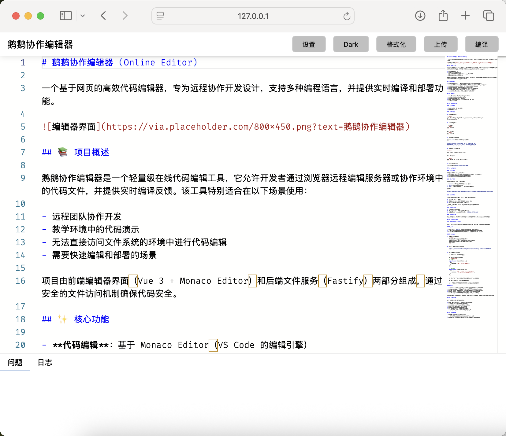
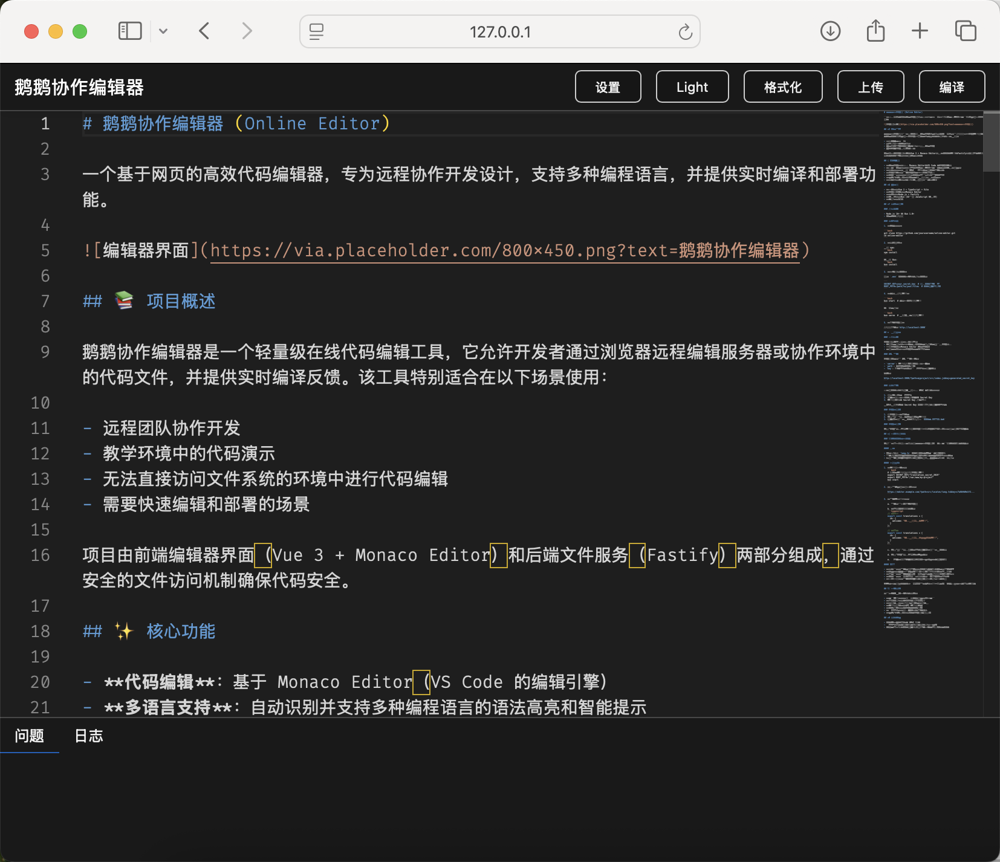

# 鹅鹅协作编辑器 (Online Editor)

一个基于网页的高效代码编辑器，专为远程协作开发设计，支持多种编程语言，并提供实时编译和部署功能。





## 📚 项目概述

鹅鹅协作编辑器是一个轻量级在线代码编辑工具，它允许开发者通过浏览器远程编辑服务器或协作环境中的代码文件，并提供实时编译反馈。该工具特别适合在以下场景使用：

- 远程团队协作开发
- 教学环境中的代码演示
- 无法直接访问文件系统的环境中进行代码编辑
- 需要快速编辑和部署的场景

项目由前端编辑器界面（Vue 3 + Monaco Editor）和后端文件服务（Fastify）两部分组成，通过安全的文件访问机制确保代码安全。

## ✨ 核心功能

- **代码编辑**：基于 Monaco Editor（VS Code 的编辑引擎）
- **多语言支持**：自动识别并支持多种编程语言的语法高亮和智能提示
- **安全机制**：使用 HMAC 加密验证确保文件访问安全
- **编译集成**：一键编译并查看实时日志输出
- **文件备份**：自动创建文件修改备份，防止意外覆盖
- **深色/浅色主题**：支持不同使用环境和个人偏好
- **自适应界面**：适配桌面和移动设备的界面布局

## 🔧 技术栈

- **前端**：Vue 3 + TypeScript + Vite
- **编辑器引擎**：Monaco Editor
- **后端**：Node.js + Fastify
- **运行时**：Bun (高性能 JavaScript 运行时)
- **样式**：SCSS

## 📦 安装与部署

### 环境要求

- Node.js 16+ 或 Bun 1.0+
- 支持现代浏览器

### 安装步骤

1. **克隆仓库**

```bash
git clone https://github.com/yourusername/online-editor.git
cd online-editor
```

2. **安装依赖**

使用 npm:
```bash
npm install
```

或使用 Bun:
```bash
bun install
```

3. **设置环境变量**

创建 `.env` 文件或设置以下环境变量：

```
SECRET_KEY=your_secret_key  # 用于文件访问加密
ROOT_PATH=/path/to/your/files  # 文件系统根路径
```

4. **构建和启动服务**

```bash
bun start  # 构建前端并启动服务
```

或开发模式：

```bash
bun serve  # 使用监听模式启动服务
```

5. **访问编辑器**

浏览器访问：`http://localhost:3000`

## 🚀 使用方法

### 基本界面

编辑器界面分为三个主要部分：
- 顶部工具栏：包含设置、主题切换、格式化、上传和编译按钮
- 中部编辑区：Monaco Editor 代码编辑区
- 底部信息区：显示编译错误、日志等信息

### URL 参数

编辑器支持通过 URL 参数配置：

- `server`: 服务器路径，默认为当前域名
- `path`: 要编辑的文件路径
- `key`: 访问密钥（可通过加密密钥自动生成）

例如：
```
http://localhost:3000/?path=myproject/src/index.js&key=generated_secret_key
```

### 安全访问

为确保文件安全，系统使用基于 HMAC 的验证机制：

1. 在设置中输入加密密钥
2. 系统自动为当前文件路径生成 Secret Key
3. 服务器端验证 Secret Key 是否匹配

也可以使用内置的 Secret Key 高级计算器手动生成密钥。

### 编辑与保存

1. 在编辑器中修改代码
2. 点击"上传"按钮将代码保存到服务器
3. 系统会自动备份原文件，格式为 `文件名.时间戳.bak`

### 编译与部署

点击"编译"按钮触发服务器端编译流程，编译日志会实时显示在底部日志区域。

## 📝 实际应用案例

### 本地化文件协作管理

这是一个真实应用场景，利用鹅鹅协作编辑器来简化多语言本地化文本的管理：

#### 背景

- 项目中包含 `lang.ts` 文件，存储各种语言的翻译文本
- 客户/翻译人员需要频繁更新翻译内容，但不需要接触其他代码
- 希望客户能快速编辑并验证翻译效果，而无需搭建完整开发环境

#### 实施方案

1. **服务器配置**：
   ```bash
   # 在产品服务器上启动编辑器服务
   export SECRET_KEY="translation_secret_2025"
   export ROOT_PATH="/var/www/my-project"
   bun start
   ```

2. **为客户提供专用链接**：
   ```
   https://editor.example.com/?path=src/locales/lang.ts&key=c7a8b9d0e1f2...
   ```

3. **客户操作流程**：

   a. 客户通过链接访问编辑器
   
   b. 修改翻译文本，例如：
   ```typescript
   // 修改前
   export const translations = {
     zh: {
       welcome: "欢迎使用我们的服务",
     }
   };
   
   // 修改后
   export const translations = {
     zh: {
       welcome: "欢迎使用我们全新升级的服务",
     }
   };
   ```
   
   c. 点击"上传"按钮保存修改（系统会自动备份原文件）
   
   d. 点击"编译"按钮触发项目重新构建
   
   e. 几分钟后，访问生产网站即可看到更新后的翻译文本

#### 优势

- **安全性**：客户仅能访问特定文件，无需完整代码库访问权限
- **效率**：无需复杂的提交-审核-部署流程，直接修改和验证
- **便捷性**：客户无需安装开发工具，仅需浏览器即可完成工作
- **可控性**：所有更改有备份，且可通过日志监控修改内容
- **实时反馈**：客户可快速验证翻译在实际环境中的效果

这种协作模式特别适合非开发人员参与的工作流程，极大简化了多方协作的沟通成本。

## ⚙️ 配置选项

通过设置面板可配置以下选项：

- **语言服务**：自动检测或手动指定编程语言
- **字体大小**：调整编辑器字体大小
- **自动换行**：启用/禁用代码自动换行
- **服务器路径**：API 服务器地址
- **文件路径**：要编辑的文件路径
- **加密密钥**：用于生成安全访问令牌
- **深色/浅色主题**：切换编辑器视觉主题

## 🔐 安全考虑

- 文件操作需要有效的 HMAC 验证
- 加密密钥应妥善保管，不应在不安全环境中共享
- 默认不暴露完整文件系统，只能访问配置的根路径下的文件
